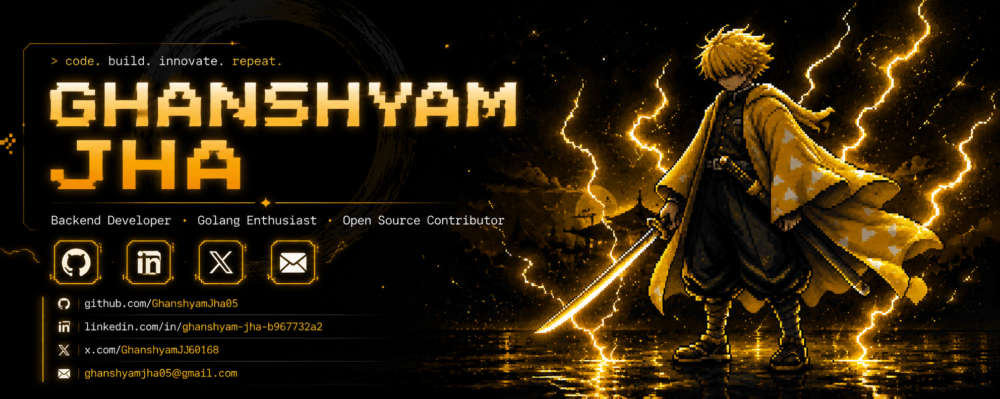

 

  

 

  

---

### ⚡ About Me

I'm a Computer Science & Engineering student passionate about building real-world solutions using Full-Stack Web Development and Machine Learning. I love exploring new technologies, from building game clones to scalable web applications — quiet most of the time, but locked in and lightning-fast when it counts.

---

## 🛠️ Tech Stack

### Languages

  
  
  
  
  

### Frontend & Backend

  
  
  
  
  

### Tools & Databases

  
  
  
  

---

## 🌟 Featured Projects

| Project | Description | Tech Stack |
|---|---|---|
| **[Minecraft Basic Clone](https://github.com/GhanshyamJha05/minecraft-basic-by-python)** | A Minecraft-like voxel game clone built with Python. | Python, Ursina Engine |
| **[Car Rental Website](https://github.com/GhanshyamJha05/Car-Rental-Website)** | A complete platform for renting cars with a modern UI. | TypeScript, Next.js |
| **[Web Scraper in Go](https://github.com/GhanshyamJha05/WEB_SCRAPPER_Using-GO)** | A high-performance web scraper to extract data efficiently. | Go (Golang) |
| **[Ideathon Project](https://github.com/GhanshyamJha05/Ideathon)** | Innovative project developed for an ideathon competition. | JavaScript, Web Tech |

---

### 🧩 Holopin Badges

---

## 📊 GitHub Stats

  
  

  

---

## 🐍 Contribution Snake 

  

---

### 🌐 Connect With Me

  
  
  

  
  Made with ⚡ by Ghanshyam Jha

